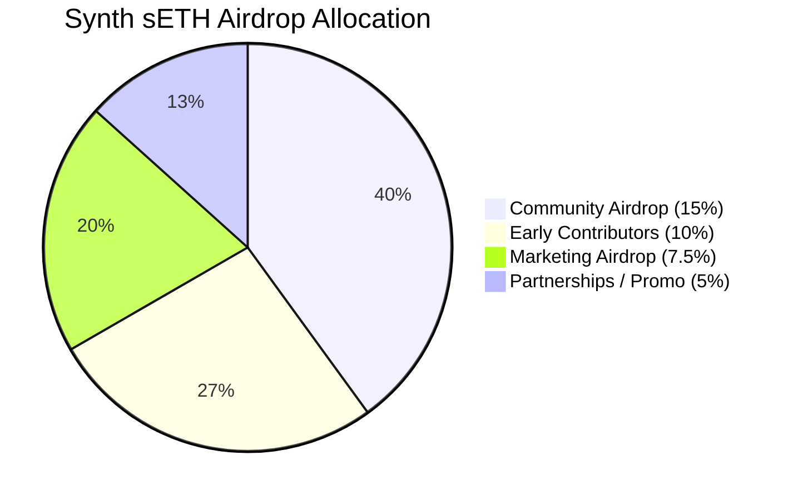

<h1 align="center">🔥 Synth sETH – Polymarket Trivia Game 🔮</h1>

<p align="center">
  <i>Real Markets. Real Probabilities. Real Decisions.<br>
  Turning prediction markets into an interactive game.</i>
</p>

<p align="center">
  
  
  
  
  
</p>

---

# 🚀 Overview — What is Synth sETH Trivia?

**Synth sETH Polymarket Trivia Game** transforms real prediction markets into a fast-paced YES/NO quiz powered by **live Polymarket probabilities**.

Every question uses *real market sentiment*, ensuring that each round reflects what actual traders believe at that moment.

The game is part of the broader **Synth sETH ecosystem**, built around a fixed-supply ERC-20 token that powers rewards, incentives, and future decentralized prediction markets.

---

# 🔮 How the Game Works

- Live questions sourced from **Polymarket Gamma API**
- YES/NO outcomes weighted by real probability (market odds)
- Time-limited rounds increase urgency and engagement
- Score, streaks, and accuracy metrics for competitive gameplay
- Future integration with on-chain rewards powered by **Synth sETH**

This creates a bridge between **prediction markets, gaming, and real-time decision-making**.

---

# 💠 Synth sETH Token — Fixed Supply of 40,000,000

Synth sETH is a fixed-supply ERC-20 utility token used within a decentralized
prediction market protocol on Ethereum.

The token powers binary YES/NO markets where users stake Synth sETH into liquidity
pools representing different outcomes. Odds are determined by liquidity imbalance,
and winning participants receive payouts in Synth sETH after market settlement.

Synth sETH is designed solely as a utility token for prediction markets.
It does not represent equity, ownership, debt, or claims on any entity.
The token does not guarantee a fixed price or peg to ETH.

Synth sETH is not a stablecoin and does not track the price of ETH.
Token value is determined entirely by market dynamics.
This repository and its contents are provided for informational purposes only
and do not constitute financial, legal, or investment advice.

The SynthETH token underpins the ecosystem with a **fixed, immutable supply of 40M sETH**.

## 🏦 1. Instant Locked Liquidity — 20,000,000 sETH (50%)
Locked permanently to support stability, deep liquidity, AMM pools, and future staking.

## 🎁 2. Community Incentives & Airdrop Pool — 15,000,000 sETH (37.5%)
Reserved for early adopters, players, contributors, and growth programs.

## 🔧 3. Ecosystem & Operations — 5,000,000 sETH (12.5%)
Used for audits, infrastructure, protocol development, integrations, and sustainability.

---

# 🎁 Airdrop Allocation (15,000,000 sETH — 37.5%)

| Category               | %     | Allocation     |
|------------------------|-------|----------------|
| Community Airdrop      | 15%   | 6,000,000      |
| Early Contributors     | 10%   | 4,000,000      |
| Marketing Airdrop      | 7.5%  | 3,000,000      |
| Partnerships / Promo   | 5%    | 2,000,000      |
| **Total**              | 37.5% | **15,000,000** |

## 📊 Airdrop Distribution Diagram



---

# 🎯 Core Game Features

- 🔮 Real Polymarket-powered questions  
- ⚖ YES/NO probability-based decisions  
- 🧠 Smart market filtering (volume, validity, outcome type)  
- ⏱ Round timer for high-tempo gameplay  
- 📈 Scoring, streaks, and performance tracking  
- 🔗 On-chain reward integration planned  

---

# 🏗 Tech Stack

### **Frontend**
- HTML  
- TailwindCSS  
- Vanilla JavaScript  
- LocalStorage wallet/username flow  

### **Backend**
- Node.js + Express  
- Polymarket Gamma API  
- Market validator & normalization engine  
- Fallback logic for degraded API responses  

---

# 🔌 API Endpoint

### `GET /api/polymarket-question`

```json
{
  "id": "market-id",
  "question": "Will BTC close above $100k before 2026?",
  "yesProb": 0.42,
  "noProb": 0.58
}
```

---

# 🔮 Market Selection Engine (Core Logic)

```js
async function getRandomYesNoMarket() {
  const r = await fetch(GAMMA_URL);
  const data = await r.json();
  const now = Date.now();

  const valid = [];

  for (const m of data) {
    if (m.closed) continue;

    const rawEnd =
      m.endTime ||
      m.endDate ||
      m.endDateIso ||
      m.events?.[0]?.endTime ||
      m.events?.[0]?.endDate;

    const endTs = rawEnd ? Date.parse(rawEnd) : null;
    if (!endTs || endTs < now) continue;

    const rawCreated =
      m.createdAt ||
      m.createdTime ||
      m.creationTime ||
      m.events?.[0]?.startTime ||
      m.events?.[0]?.startDate;

    const createdTs = rawCreated ? Date.parse(rawCreated) : null;
    if (createdTs && now - createdTs > 550 * 24 * 60 * 60 * 1000) continue;

    const volume = Number(m.volume || m.totalVolume || 0);
    if (volume < 30) continue;

    let outcomes = m.outcomes;
    let prices = m.outcomePrices;

    try {
      if (typeof outcomes === "string") outcomes = JSON.parse(outcomes);
      if (typeof prices === "string") prices = JSON.parse(prices);
    } catch {
      continue;
    }

    if (!Array.isArray(outcomes) || !Array.isArray(prices)) continue;
    if (outcomes.length !== 2 || prices.length !== 2) continue;

    const norm = o => String(o).toLowerCase().replace(/[^a-z]/g, "");
    const normalized = outcomes.map(norm);

    const yesIdx = normalized.indexOf("yes");
    const noIdx = normalized.indexOf("no");
    if (yesIdx === -1 || noIdx === -1) continue;

    const yes = parseFloat(prices[yesIdx]);
    const no = parseFloat(prices[noIdx]);
    if (!isFinite(yes) || !isFinite(no)) continue;

    valid.push({
      id: m.id,
      question:
        m.question ||
        m.title ||
        (m.slug ? m.slug.replace(/-/g, " ") : "Unknown question"),
      yesProb: yes,
      noProb: no
    });
  }

  if (!valid.length) {
    return {
      id: "fallback",
      question: "Will Bitcoin go up tomorrow?",
      yesProb: 0.5,
      noProb: 0.5
    };
  }

  return valid[Math.floor(Math.random() * valid.length)];
}
```

---

# 📄 License

Distributed under the **MIT License**.

<h3 align="center">⚡ Built for the Synth sETH Ecosystem ⚡</h3>
